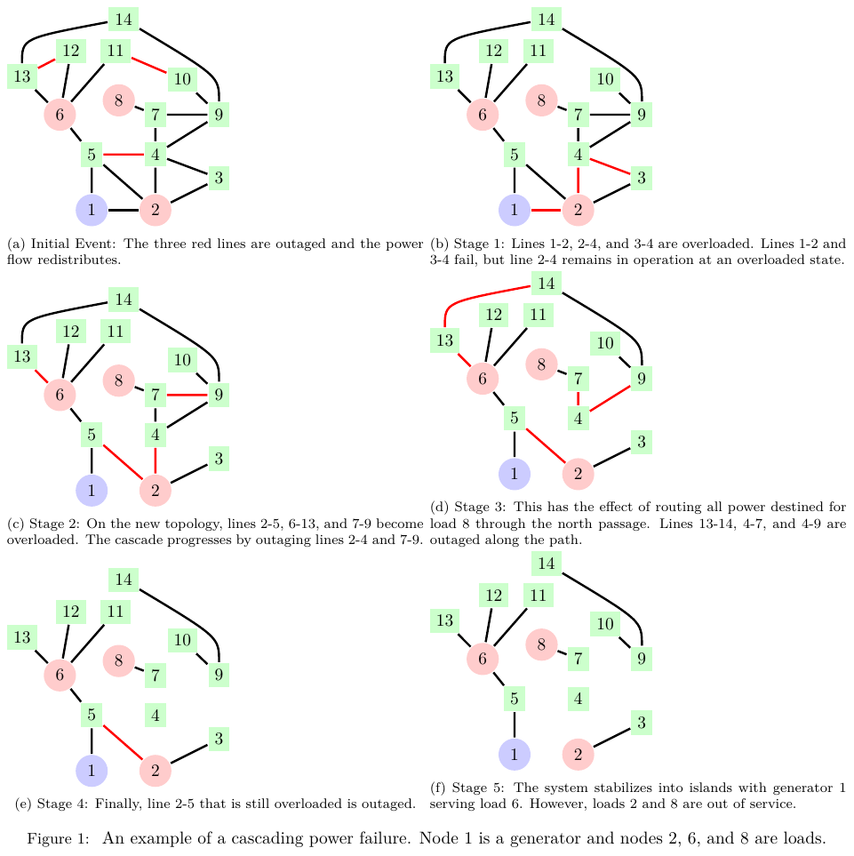
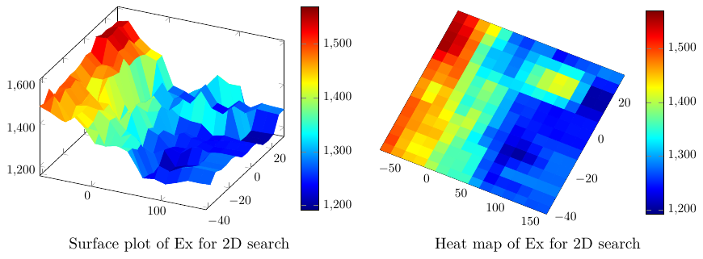
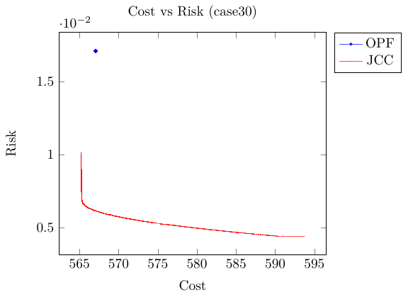
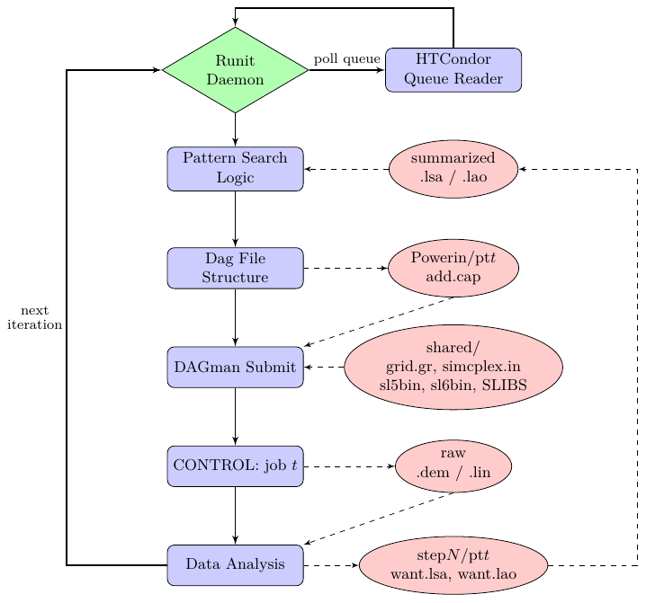

# Computational Models for Line Failure Risk and Cascading Power Failures on Bulk Power Systems

**Eric Anderson** — PhD dissertation, Industrial and Systems Engineering, University of Wisconsin–Madison, 2015
Advisor: Jeffrey Linderoth. Committee: James Luedtke, Bernard Lesieutre, Thomas Rutherford, Stephen Wright.

**[Download the PDF →](https://github.com/eanderson4/thesis/releases/latest)**

---

A large blackout is not one failure. It is a line tripping, power redistributing onto neighbors that were already near their limits, and those tripping in turn — a chain that runs to completion in minutes and settles into islands. The load shed from these events follows a power-tail distribution with exponent −1.3 ± 0.2, and that exponent has held for thirty years. Rare, enormously expensive, and structurally resistant to the usual planning tools.

This thesis builds optimization models that reduce the risk of those events, working from two directions: **long-term design** (where should capacity go?) and **real-time dispatch** (how should the system be operated right now?). Both are optimization under uncertainty where the uncertainty depends on the decision — adding capacity to a line changes the distribution of what fails next.



*A cascade walked stage by stage. Three lines are outaged; flow redistributes; overloaded lines fail; the process repeats. By stage 5 the system has stabilized into islands with two loads out of service. Each stage is a DC optimal power flow on a changed topology.*

## The four chapters

**Ch. 2 — Modeling cascading power failures.** Recasts the OPA cascading failure simulation as a multi-stage stochastic program with mixed-integer variables. The obstacle is decision-dependent uncertainty: the capacity you choose changes the failure distribution you face. This is resolved with the concept of **effective capacity** plus a priori sampling, which pulls the decision out of the distribution and makes the program well-posed. The model matches the simulation's load-shed distribution. It is also computationally intractable at realistic system sizes — which motivates Ch. 3.

**Ch. 3 — Transmission expansion via derivative-free optimization.** Decompose the scenario tree, evaluate load shed by Monte Carlo, and optimize the design directly. The objective is a black box: non-convex, discontinuous, and noisy, with a wide power-law output distribution. Three things make it tractable — a **common random number** scheme so two candidate designs face identical experimental conditions (turning the variance of a difference into something small), **generating set / compass search** for convergence guarantees without derivatives, and **breakpoint finding** to avoid paying for evaluations that cannot move the objective.



*Expected load shed over capacity additions to two lines. This is the surface the search is working on — no gradient, no convexity, and a noise floor set by how many cascade trials you can afford.*

**Ch. 4 — A system risk measure for real-time dispatch.** Standard chance-constrained dispatch bounds each line separately. What operators actually want is a bound on *any* line failing. That gives a **joint chance constraint**. Assuming net injections are multivariate Gaussian, the DC approximation makes branch flows multivariate Gaussian too, with a covariance matrix computed from the injection shift factors. A Taylor linearization of the risk measure — accurate precisely in the small-probability regime that matters — makes the problem convex, solved by a cutting-plane algorithm.

**Ch. 5 — Joining the two.** Extends the joint chance constraint to N-1 contingencies, uses those contingencies to seed the OPA simulation, and derives a linear weighting of how much each line matters to cascade risk. The weighted model keeps the convex cutting-plane structure while carrying rare-event information from the simulation, and produces a more desirable load-shed distribution.



*The cost-risk frontier. The single point is the standard OPF solution; the curve is what the joint chance constraint traces out. Most of the risk reduction is available for very little money — the frontier is nearly flat until it isn't.*

## Scale

Each function evaluation is a full cascade simulation over many trials — **5 to 30 minutes on one core**. A single search iteration proposes 1,000–2,000 trial points, so an iteration costs on the order of 100–1,000 CPU-hours. That was run on UW–Madison's [Center for High Throughput Computing](https://chtc.cs.wisc.edu/) via HTCondor, flocking to the Open Science Grid, with binaries built for two Linux kernels and memory held under 500 MB to reach as much of the pool as possible.



*The scheduler: a `runit` daemon polls the HTCondor queue, and on an empty queue summarizes results, runs the pattern search logic to pick the next trial points, builds the DAGMan submit structure, and submits. Raw simulation output is reduced to risk metrics on the remote node so only ~8 KB comes back over the network.*

## Figures

Curated in [`figures/`](figures/), regenerated by [`scripts/export-figures.sh`](scripts/export-figures.sh):

| | |
|---|---|
| [`cascade-example.png`](figures/cascade-example.png) | Stage-by-stage cascade on the IEEE 14-bus system |
| [`capacity-surface.png`](figures/capacity-surface.png) | 2-D response surface and heat map of expected load shed |
| [`line-breakpoints.png`](figures/line-breakpoints.png) | Expected load shed vs. capacity — flat regions and hard jumps |
| [`risk-measures.png`](figures/risk-measures.png) | Expectation, std. dev., VaR, CVaR and max over a search route |
| [`effective-capacity.png`](figures/effective-capacity.png) | Line failure density and the effect of added capacity |
| [`cost-risk-frontier.png`](figures/cost-risk-frontier.png) | OPF vs. joint chance constraint |
| [`parallel-search.png`](figures/parallel-search.png) | HTCondor process flow for parallel OPA evaluation |

## Building

Requires a TeX distribution with `pgfplots`, `forest`, `cleveref`, `algpseudocode`, `standalone` and `tikz-ext` (TeX Live 2023 or newer works as-is):

```sh
make            # figures, then lualatex -> bibtex -> lualatex x2  => main.pdf
make figures    # just the standalone figure PDFs
make clean      # remove LaTeX side files
make distclean  # also remove compiled figures and main.pdf
```

Most figures are separate `standalone` documents compiled to PDF and pulled into the chapters with `\includegraphics`, so **`make figures` has to run before the main document** — that is what the default target does. Each figure resolves its data paths relative to its own directory, so the Makefile compiles each from its own folder.

## Layout

```
main.tex          document root            msip/   Ch. 2  multi-stage stochastic program
header.tex        preamble and macros      dfo/    Ch. 3  derivative-free optimization
title.tex         title page               jcc/    Ch. 4  joint chance constraints
intro/            Ch. 1  introduction      oj/     Ch. 5  JCC with OPA weighting
back.tex          conclusion, appendix     figures/  curated PNGs
```

The solvers live in separate repositories: [`opt-opa`](https://github.com/eanderson4/opt-opa) (optimization over the OPA structure with a variable first-stage model), [`msip`](https://github.com/eanderson4/msip) (cascade solved over a stochastic tree with common random numbers), and [`pow-opt`](https://github.com/eanderson4/pow-opt) (power grid calculations).

## Notes on this repository

The text is as submitted in 2015; this pass restored the build and the presentation, not the content. Two gaps survive from the original repo and are marked in the PDF rather than hidden:

- The Chapter 3 HTCondor driver scripts (`dfo/code/`) were never committed, so those code listings render a placeholder pointing at the solver repos.
- Three result data files (`jcc/data/cost-risk6.dat`, `oj/data/jccS*.out`) were not preserved, so those panels render a labeled placeholder box. Figures `fig-capadd` and `fig-linecluster` were repointed at surviving data files with identical schema, so their curves may differ slightly from the printed 2015 version.

Two figures whose sources were lost (`dfo/fig-effectivecapacity`, `dfo/fig-parallel`) have been reconstructed from the surrounding text and tables.
